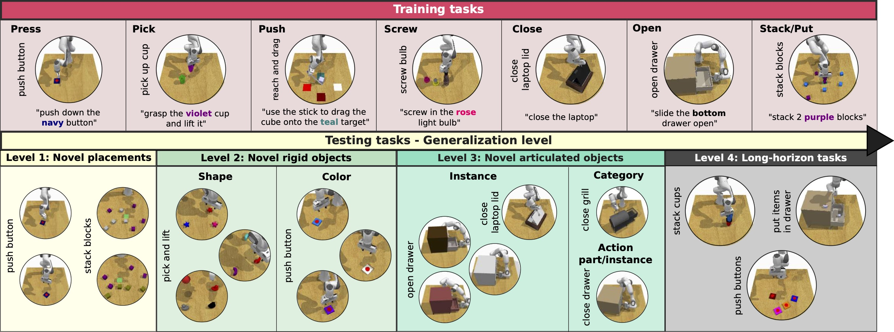
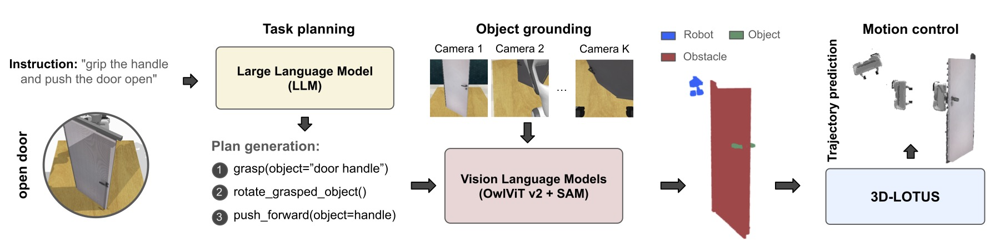

<div align="center">
  <h2>Towards Generalizable Vision-Language Robotic Manipulation: <br>A Benchmark and LLM-guided 3D Policy</h2>
  <h4>
    <a href="http://rjgpinel.github.io/">Ricardo Garcia*</a>,
    <a href="https://cshizhe.github.io/">Shizhe Chen*</a>,
    <a href="https://cordeliaschmid.github.io/">Cordelia Schmid</a>
  </h4>
  <h4>ICRA 2025</h4>

  <!-- Badges -->
  <p>
    <a href="https://www.di.ens.fr/willow/research/gembench/">
      
    </a>
    <a href="https://arxiv.org/abs/2410.01345">
      
    </a>
  </p>
  
[](https://paperswithcode.com/sota/robot-manipulation-generalization-on-gembench?p=towards-generalizable-vision-language-robotic)
[](https://paperswithcode.com/sota/robot-manipulation-on-rlbench?p=towards-generalizable-vision-language-robotic)

</div>


## Overview

Generalizing language-conditioned robotic policies to new tasks remains a significant challenge, hampered by the lack of suitable simulation benchmarks. In this paper, we address this gap by introducing GemBench, a novel benchmark to assess generalization capabilities of vision-language robotic manipulation policies. As illustrated in the figure below, GemBench incorporates seven general action primitives and four levels of generalization, spanning novel placements, rigid and articulated objects, and complex long-horizon tasks. 



We evaluate state-of-the-art approaches on GemBench and also introduce a new method. Our approach 3D-LOTUS leverages rich 3D information for action prediction conditioned on language. While 3D-LOTUS excels in both efficiency and performance on seen tasks, it struggles with novel tasks. To address this, we present 3D-LOTUS++ (see figure below), a framework that integrates 3D-LOTUS's motion planning capabilities with the task planning capabilities of LLMs and the object grounding accuracy of VLMs. 3D-LOTUS++ achieves state-of-the-art performance on novel tasks of GemBench, setting a new standard for generalization in robotic manipulation.



## Installation
See [INSTALL.md](INSTALL.md) for detailed instructions in installation.

## Dataset

You can follow the instructions [here](DATAGEN.md) to generate the training data on your own, or download our generated dataset.

The dataset can be found in [Dropbox](https://www.dropbox.com/scl/fo/y0jj42hmrhedofd7dmb53/APlY-eJRqv375beJTIOszFc?rlkey=2txputjiysyg255oewin2m4t2&st=vfoctgi3&dl=0).
Put the dataset in the `data/gembench` folder.
Dataset structure is as follows:
```
- data
    - gembench
        - train_dataset
            - microsteps: 567M, initial configurations for each episode
            - keysteps_bbox: 160G, extracted keysteps data
            - keysteps_bbox_pcd: (used to train 3D-LOTUS)
                - voxel1cm: 10G, processed point clouds
                - instr_embeds_clip.npy: instructions encoded by CLIP text encoder
            - motion_keysteps_bbox_pcd: (used to train 3D-LOTUS++ motion planner)
                - voxel1cm: 2.8G, processed point clouds
                - action_embeds_clip.npy: action names encoded by CLIP text encoder
        - val_dataset
            - microsteps: 110M, initial configurations for each episode
            - keysteps_bbox_pcd:
                - voxel1cm: 941M, processed point clouds
        - test_dataset
            - microsteps: 2.2G, initial configurations for each episode
```

The RLBench-18task dataset (peract) can be downloaded [here](https://www.dropbox.com/scl/fo/f01284con45rv1j80um1x/AAHs9tK4vFQPRvHKALvFUu4?rlkey=6lz54q7zwont1sb2ft25ib6k1&st=6p85ymk9&dl=0), following the same dataset structure as gembench.


## 3D-LOTUS Policy

### Training
Train the 3D-LOTUS policy end-to-end on the GemBench train split. It takes about 14h with a single A100 GPU.
```bash
sbatch job_scripts/train_3dlotus_policy.sh
```

The trained checkpoints are available [here](https://www.dropbox.com/scl/fo/0g6iz7d7zb524339dgtms/AHS42SO7aPpwut8I8YN8H3w?rlkey=3fwdehsguqsxofzq9kp9fy8fm&st=eqdd6qvf&dl=0). You should put them in the folder `data/experiments/gembench/3dlotus/v1`.

### Evaluation
```bash
# both validation and test splits
sbatch job_scripts/eval_3dlotus_policy.sh
```

The evaluation script evaluates the 3D-LOTUS policy on the validation (seed100) and test splits of the GemBench benchmark.
The evaluation script skips any task that has already been evaluated before and whose results are already saved in `data/experiments/gembench/3dlotus/v1/preds/` so make  sure to clean it if you want to re-evaluate a task that you already evaluated.

We use the validation set to select the best checkpoint. The following script summarizes results on the validation split.
```bash
python scripts/summarize_val_results.py data/experiments/gembench/3dlotus/v1/preds/seed100/results.jsonl
```

The following script summarizes results on the test splits of four generalization levels:
```bash
python scripts/summarize_tst_results.py data/experiments/gembench/3dlotus/v1/preds 150000
```

### Training and Evaluation on RLBench-18task dataset (peract)

```bash
sbatch job_scripts/train_3dlotus_policy_peract.sh
sbatch job_scripts/eval_3dlotus_policy_peract.sh
```

The trained checkpoints are available [here](https://www.dropbox.com/scl/fi/4qz7p7v5pwf3wvoi9dgr7/3dlotus.tar.gz?rlkey=nmlufbdx5uxhhsr7gn0glv77s&st=obhogdgk&dl=0). You should put them in the folder `data/experiments/peract/3dlotus/v1`.

## 3D-LOTUS++ Policy with LLM and VLM

Download llama3-8B model following [instructions here](https://github.com/cshizhe/llama3?tab=readme-ov-file#download), and modify the configuration path in `genrobo3d/configs/rlbench/robot_pipeline.yaml`.

### Training

Train the 3D-LOTUS++ motion planning policy on the GemBench train split. It takes about 14h with a single A100 GPU.
```bash
sbatch job_scripts/train_3dlotusplus_motion_planner.sh
```

The trained checkpoints are available [here](https://www.dropbox.com/scl/fo/e623fv9wvu8ke1qjp7ni5/AEydRnEnUHk-eA6n5EVsb_E?rlkey=1uv7fl7zfega1ed80qw3gbzge&st=whuys6zg&dl=0). You should put them in the folder data/experiments/gembench/3dlotusplus/v1

### Evaluation

We have three evaluation modes: 
1) groundtruth task planner + groundtruth object grounding + automatic motion planner
2) groundtruth task planner + automatic object grounding + automatic motion planner
3) automatic task planner + automatic object grounding + automatic motion planner

See comments in the following scripts:
```bash
# both validation and test splits
sbatch job_scripts/eval_3dlotusplus_policy.sh
```

## Notebooks
Run our models on the RLBench simulator with jupyter notebook in interactive mode:
- [`notebooks/eval_3dlotus_policy.ipynb`](notebooks/eval_3dlotus_policy.ipynb)
- [`notebooks/eval_3dlotus++_policy.ipynb`](notebooks/eval_3dlotus++_policy.ipynb)


## Citation
If you use our GemBench benchmark or find our code helpful, please kindly cite our work:
```bibtex
 @inproceedings{garcia25gembench,
    author    = {Ricardo Garcia and Shizhe Chen and Cordelia Schmid},
    title     = {Towards Generalizable Vision-Language Robotic Manipulation: A Benchmark and LLM-guided 3D Policy},
    booktitle = {IEEE International Conference on Robotics and Automation (ICRA)},
    year      = {2025}
}
```
